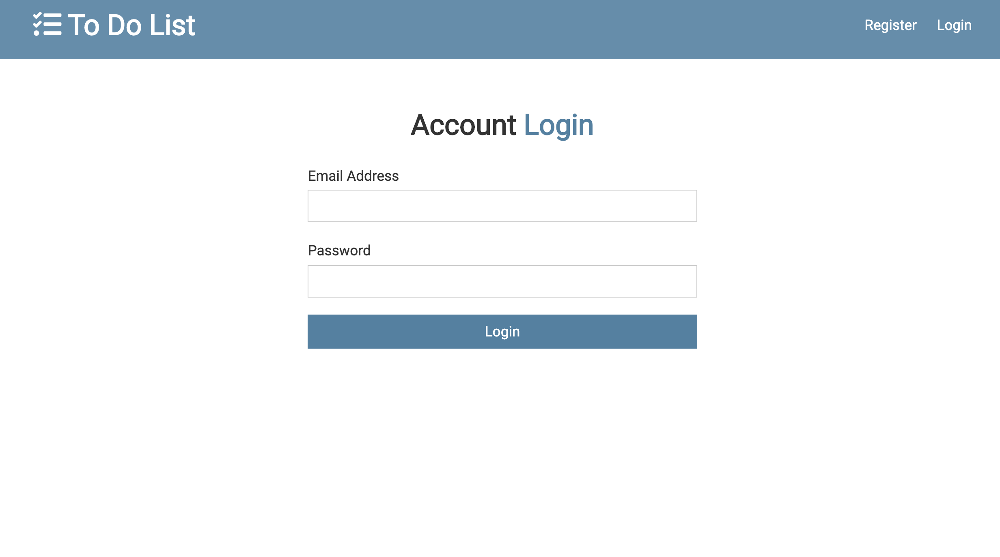
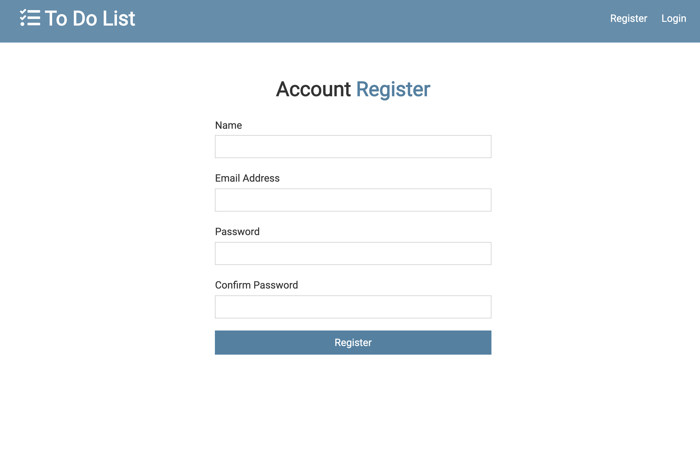
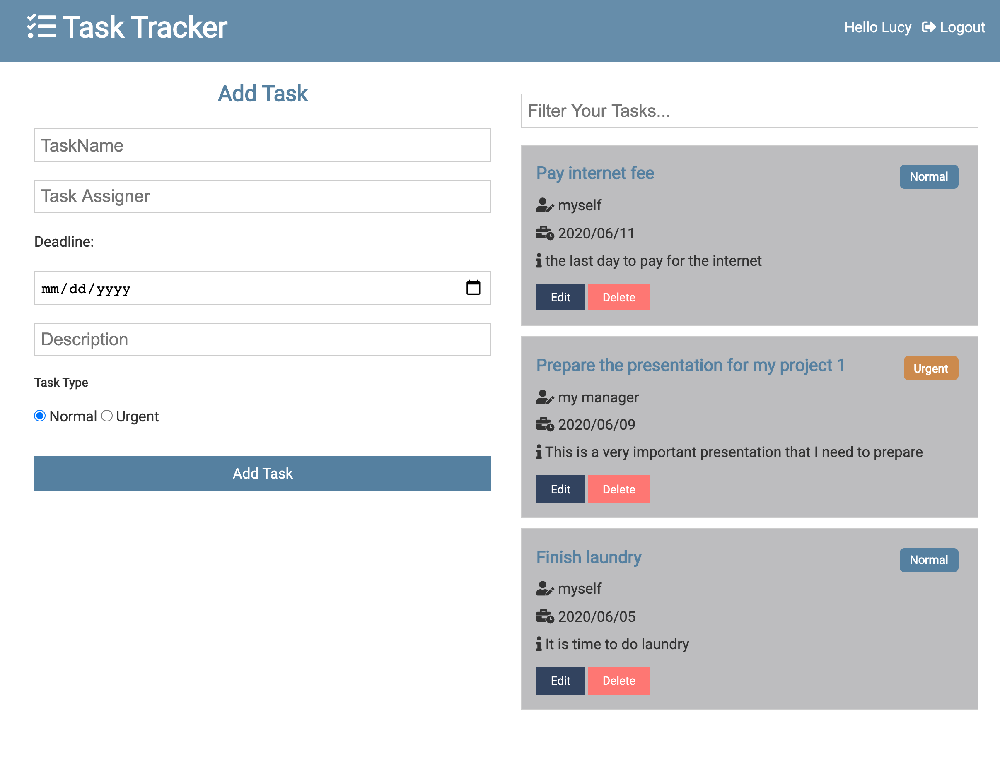
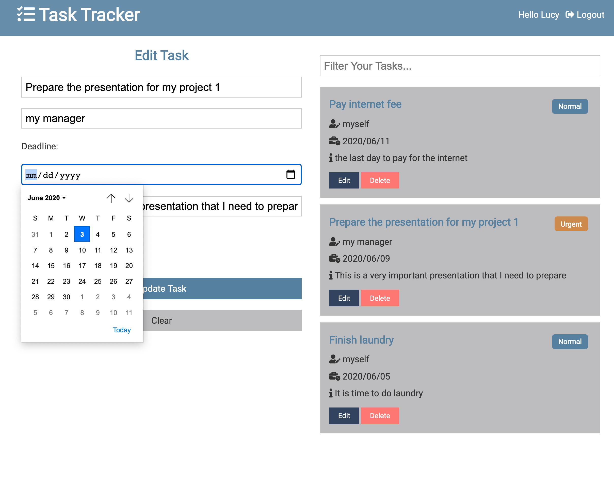
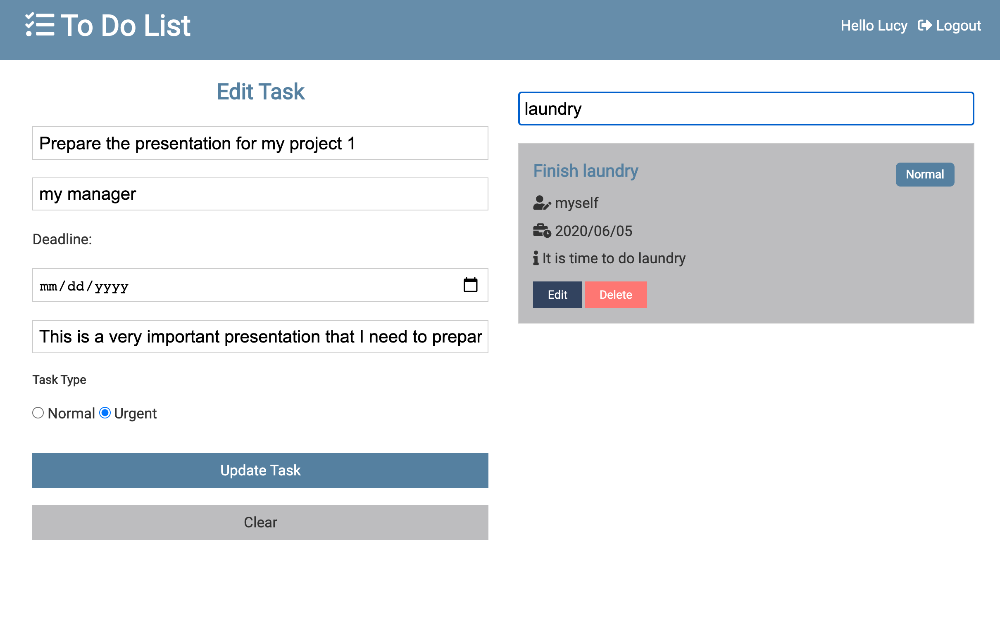
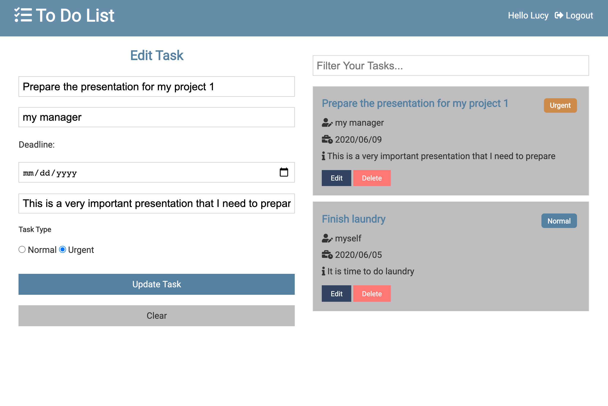
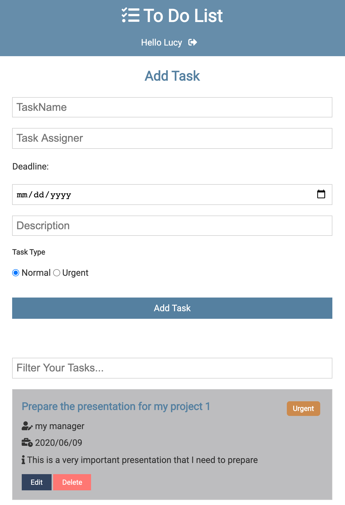

# To Do List

### This is a very simple Full Stack React application to keep track your to do list. You can simply add, edit, filter, delete your to do tasks.

### Want to try this simple app? Please go [To Do List](https://boiling-basin-73952.herokuapp.com/login)and register your account, track and update your to do list.

### To login your account:

### If you have not register an account, please register an account first

### The validation for the login/register page, and this is very important to make you have filled out all required fileds.

### Please take a look the simple look of the home page, you may see the the to do task has 2 categories, one is urgent, one is normal task, and the button color for the 2 categories are different.
;

### You may simply pick the date with clean look

### It is important to have the function for you to find a specific task, you can use the filter function to do it.

### To update a task

### this is also mobile friendly

### Technologies I am using in this project
- React
- React Hook
- Node.js
- MongoDB
- Express.js
- moment.js
- bcryptjs
- express-validator
- jsonwebtoken
- axios
